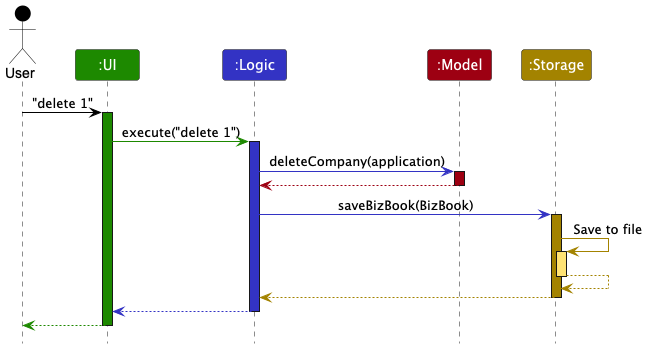
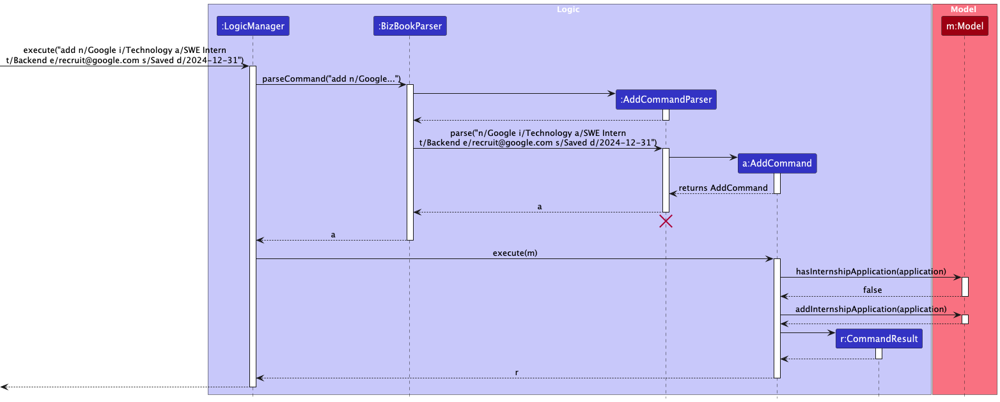

* Table of Contents
{:toc}

--------------------------------------------------------------------------------------------------------------------

## **Acknowledgements**

This project is based on the AddressBook-Level3 project from [SE-EDU initiative](https://se-education.org), but has evolved into **BizBook**, a desktop app for managing internship applications.

--------------------------------------------------------------------------------------------------------------------

## **Setting up, getting started**

Refer to the guide [_Setting up and getting started_](SettingUp.md).

--------------------------------------------------------------------------------------------------------------------

## **Design**

:bulb: **Tip:** The `.puml` files used to create diagrams are in this document `docs/diagrams` folder. Refer to the [_PlantUML Tutorial_ at se-edu/guides](https://se-education.org/guides/tutorials/plantUml.html) to learn how to create and edit diagrams.

### Architecture

The ***Architecture Diagram*** given above explains the high-level design of the App.

Given below is a quick overview of main components and how they interact with each other.

**Main components of the architecture**

**`Main`** (consisting of classes [`Main`](https://github.com/se-edu/addressbook-level3/tree/master/src/main/java/seedu/description/Main.java) and [`MainApp`](https://github.com/se-edu/addressbook-level3/tree/master/src/main/java/seedu/description/MainApp.java)) is in charge of the app launch and shut down.
* At app launch, it initializes the other components in the correct sequence, and connects them up with each other.
* At shut down, it shuts down the other components and invokes cleanup methods where necessary.

The bulk of the app's work is done by the following four components:

* [**`UI`**](#ui-component): The UI of the App.
* [**`Logic`**](#logic-component): The command executor.
* [**`Model`**](#model-component): Holds the data of the App in memory.
* [**`Storage`**](#storage-component): Reads data from, and writes data to, the hard disk.

[**`Commons`**](#common-classes) represents a collection of classes used by multiple other components.

**How the architecture components interact with each other**

The *Sequence Diagram* below shows how the components interact with each other for the scenario where the user issues the command `delete 1`.

Each of the four main components (also shown in the diagram above),

* defines its *API* in an `interface` with the same companyName as the Component.
* implements its functionality using a concrete `{Component Name}Manager` class (which follows the corresponding API `interface` mentioned in the previous point.

For example, the `Logic` component defines its API in the `Logic.java` interface and implements its functionality using the `LogicManager.java` class which follows the `Logic` interface. Other components interact with a given component through its interface rather than the concrete class (reason: to prevent outside component's being coupled to the implementation of a component), as illustrated in the (partial) class diagram below.

The sections below give more details of each component.

### UI component

The **API** of this component is specified in [`Ui.java`](https://github.com/se-edu/addressbook-level3/tree/master/src/main/java/seedu/description/ui/Ui.java)

The UI consists of a `MainWindow` that is made up of parts e.g. `CommandBox`, `ResultDisplay`, `ApplicationListPanel`, `StatusBarFooter` etc. All these, including the `MainWindow`, inherit from the abstract `UiPart` class which captures the commonalities between classes that represent parts of the visible GUI.

The `UI` component uses the JavaFx UI framework. The layout of these UI parts are defined in matching `.fxml` files that are in the `src/main/resources/view` folder. For example, the layout of the [`MainWindow`](https://github.com/se-edu/addressbook-level3/tree/master/src/main/java/seedu/description/ui/MainWindow.java) is specified in [`MainWindow.fxml`](https://github.com/se-edu/addressbook-level3/tree/master/src/main/resources/view/MainWindow.fxml)

The `UI` component,

* executes user commands using the `Logic` component.
* listens for changes to `Model` data so that the UI can be updated with the modified data.
* keeps a reference to the `Logic` component, because the `UI` relies on the `Logic` to execute commands.
* depends on some classes in the `Model` component, as it displays `Application` objects residing in the `Model`.

### Logic component

**API** : [`Logic.java`](https://github.com/se-edu/addressbook-level3/tree/master/src/main/java/seedu/description/logic/Logic.java)

Here's a (partial) class diagram of the `Logic` component:

The sequence diagram below illustrates the interactions within the `Logic` component, taking `execute("delete 1")` API call as an example.

:information_source: **Note:** The lifeline for `DeleteCommandParser` should end at the destroy marker (X) but due to a limitation of PlantUML, the lifeline continues till the end of diagram.

How the `Logic` component works:

1. When `Logic` is called upon to execute a command, it is passed to an `AddressBookParser` object which in turn creates a parser that matches the command (e.g., `DeleteCommandParser`) and uses it to parse the command.
1. This results in a `Command` object (more precisely, an object of one of its subclasses e.g., `DeleteCommand`) which is executed by the `LogicManager`.
1. The command can communicate with the `Model` when it is executed (e.g. to delete a internshipApplication). 
   Note that although this is shown as a single step in the diagram above (for simplicity), in the code it can take several interactions (between the command object and the `Model`) to achieve.
1. The result of the command execution is encapsulated as a `CommandResult` object which is returned back from `Logic`.

Here are the other classes in `Logic` (omitted from the class diagram above) that are used for parsing a user command:

How the parsing works:
* When called upon to parse a user command, the `AddressBookParser` class creates an `XYZCommandParser` (`XYZ` is a placeholder for the specific command companyName e.g., `AddCommandParser`) which uses the other classes shown above to parse the user command and create a `XYZCommand` object (e.g., `AddCommand`) which the `AddressBookParser` returns back as a `Command` object.
* All `XYZCommandParser` classes (e.g., `AddCommandParser`, `DeleteCommandParser`, ...) inherit from the `Parser` interface so that they can be treated similarly where possible e.g, during testing.

### Model component
**API** : [`Model.java`](https://github.com/se-edu/addressbook-level3/tree/master/src/main/java/seedu/description/model/Model.java)

The `Model` component,

* stores the internship application data i.e., all `Application` objects (which are contained in a `UniqueApplicationList` object).
* stores the currently 'selected' `Application` objects (e.g., results of a search query) as a separate _filtered_ list which is exposed to outsiders as an unmodifiable `ObservableList<Application>` that can be 'observed' e.g. the UI can be bound to this list so that the UI automatically updates when the data in the list change.
* stores a `UserPref` object that represents the user's preferences. This is exposed to the outside as a `ReadOnlyUserPref` objects.
* does not depend on any of the other three components (as the `Model` represents data entities of the domain, such as internship applications, they should make sense on their own without depending on other components)

:information_source: **Note:** An alternative (arguably, a more OOP) model is given below. It has a `Tag` list in BizBook, which `Application` references. This allows BizBook to only require one `Tag` object per unique tag, instead of each `Application` needing their own `Tag` objects. 

### Storage component

**API** : [`Storage.java`](https://github.com/se-edu/addressbook-level3/tree/master/src/main/java/seedu/description/storage/Storage.java)

The `Storage` component,
* can save both BizBook data (internship applications) and user preference data in JSON format, and read them back into corresponding objects.
* inherits from both `BizBookStorage` and `UserPrefStorage`, which means it can be treated as either one (if only the functionality of only one is needed).
* depends on some classes in the `Model` component (because the `Storage` component's job is to save/retrieve objects that belong to the `Model`)

### Common classes

Classes used by multiple components are in the `seedu.description.commons` package.

--------------------------------------------------------------------------------------------------------------------

## **Implementation**

This section describes some noteworthy details on how certain features are implemented.

### Add Feature

The `add` command allows users to add a new internship application to BizBook with all required fields.

#### Implementation

The add mechanism is facilitated by `AddCommand` and `AddCommandParser`. The parser validates and extracts the required fields (company name, industry, job type, description, email, status, and deadline) from the user input.

The following sequence diagram shows how an add operation works:

:information_source: **Note:** The lifeline for `AddCommandParser` should end at the destroy marker (X) but due to a limitation of PlantUML, the lifeline continues till the end of diagram.

How the `add` command works:

1. When the user executes the `add` command (e.g., `add n/Google i/Technology t/SWE Intern d/Software engineering role e/recruit@google.com s/Applied dl/2024-12-31`), the `LogicManager` passes the input to `AddressBookParser`.
2. `AddressBookParser` identifies this as an `add` command and creates an `AddCommandParser` to parse the arguments.
3. `AddCommandParser` uses `ArgumentTokenizer` to extract all the prefixed fields (n/, i/, t/, d/, e/, s/, dl/) from the command string.
4. `AddCommandParser` validates each field using the respective classes (`CompanyName`, `Industry`, `JobType`, etc.) and creates an `InternshipApplication` object.
5. `AddCommandParser` creates and returns an `AddCommand` with the new `InternshipApplication`.
6. `LogicManager` executes the `AddCommand`, which checks for duplicates in the `Model`.
7. If no duplicate exists (same company name AND job type), the application is added to BizBook via `Model#addApplication()`.
8. The command returns a `CommandResult` with a success message, which is displayed to the user.

#### Design considerations:

**Aspect: Duplicate detection:**

* **Current implementation:** Two applications are considered duplicates if they have the same company name AND job type.
  * Pros: Allows tracking multiple positions at the same company (e.g., "Google SWE Intern" and "Google PM Intern").
  * Cons: Cannot track the same position applied in different rounds.

* **Alternative:** Consider only company name for duplicates.
  * Pros: Simpler logic.
  * Cons: Cannot track multiple different positions at the same company.

### Edit Feature

The `edit` command allows users to modify any field of an existing internship application.

#### Implementation

The edit mechanism is facilitated by `EditCommand` and `EditCommandParser`. The parser creates an `EditApplicationDescriptor` containing the fields to be updated.

The following sequence diagram shows how an edit operation works:

:information_source: **Note:** The lifeline for `EditCommandParser` should end at the destroy marker (X) but due to a limitation of PlantUML, the lifeline continues till the end of diagram.

How the `edit` command works:

1. When the user executes the `edit` command (e.g., `edit 1 s/Interviewing dl/2024-11-30`), the `LogicManager` passes the input to `AddressBookParser`.
2. `AddressBookParser` identifies this as an `edit` command and creates an `EditCommandParser` to parse the arguments.
3. `EditCommandParser` extracts the index and creates an `EditApplicationDescriptor` containing only the fields to be updated (in this example, status and deadline).
4. `EditCommandParser` creates and returns an `EditCommand` with the index and descriptor.
5. `LogicManager` executes the `EditCommand`, which retrieves the application at the specified index from the filtered list.
6. `EditCommand` creates a new `InternshipApplication` by copying the original application and applying the changes from the descriptor.
7. The edited application is validated to ensure it doesn't create a duplicate (same company name AND job type as another application).
8. If valid, `Model#setApplication()` replaces the old application with the edited one.
9. The command returns a `CommandResult` with a success message showing the updated application details.

#### Design considerations:

**Aspect: Editing behavior:**

* **Current implementation:** Only specified fields are updated; unspecified fields remain unchanged.
  * Pros: User-friendly - no need to re-enter all fields.
  * Cons: Cannot easily "clear" optional fields.

* **Alternative:** Require all fields to be specified.
  * Pros: Explicit and predictable behavior.
  * Cons: Tedious for users making small changes.

### Find Feature

The `find` command allows users to search for applications by company name using partial matching.

#### Implementation

The find mechanism uses `NameContainsKeywordsPredicate` to filter applications. The predicate performs case-insensitive partial matching, so searching for "tech" will match "TechCorp", "FinTech Solutions", etc.

The following sequence diagram shows how a find operation works:

:information_source: **Note:** The lifeline for `FindCommandParser` should end at the destroy marker (X) but due to a limitation of PlantUML, the lifeline continues till the end of diagram.

How the `find` command works:

1. When the user executes the `find` command (e.g., `find Google Microsoft`), the `LogicManager` passes the input to `AddressBookParser`.
2. `AddressBookParser` identifies this as a `find` command and creates a `FindCommandParser` to parse the arguments.
3. `FindCommandParser` splits the input into keywords (in this example, "Google" and "Microsoft") and creates a `NameContainsKeywordsPredicate` with these keywords.
4. `FindCommandParser` creates and returns a `FindCommand` with the predicate.
5. `LogicManager` executes the `FindCommand`, which calls `Model#updateFilteredApplicationList()` with the predicate.
6. The `Model` applies the predicate to filter the application list. The predicate checks if any keyword appears as a substring in the company name (case-insensitive).
7. The filtered list is updated in the UI, showing only applications whose company names contain any of the search keywords.
8. The command returns a `CommandResult` with a message showing the number of applications found.

#### Design considerations:

**Aspect: Matching strategy:**

* **Current implementation:** Partial substring matching (case-insensitive).
  * Pros: More flexible - finds results even with incomplete company names.
  * Cons: May return more results than expected.

* **Alternative:** Exact word matching only.
  * Pros: More precise results.
  * Cons: Requires users to remember exact company names.

### Filter Feature

The `filter` command allows users to filter applications by status, industry, or job type.

#### Implementation

The filter mechanism uses predicate classes (`StatusPredicate`, `IndustryPredicate`, `JobTypePredicate`) to filter the application list. Multiple filters can be combined.

The following sequence diagram shows how a filter operation works:

:information_source: **Note:** The lifeline for `FilterCommandParser` should end at the destroy marker (X) but due to a limitation of PlantUML, the lifeline continues till the end of diagram.

How the `filter` command works:

1. When the user executes the `filter` command (e.g., `filter s/Applied i/Technology`), the `LogicManager` passes the input to `AddressBookParser`.
2. `AddressBookParser` identifies this as a `filter` command and creates a `FilterCommandParser` to parse the arguments.
3. `FilterCommandParser` uses `ArgumentTokenizer` to extract the filter criteria (s/ for status, i/ for industry, t/ for job type).
4. For each filter criterion present, `FilterCommandParser` creates the corresponding predicate (`StatusPredicate`, `IndustryPredicate`, or `JobTypePredicate`).
5. If multiple filters are specified, they are combined using `Predicate.and()` to create a composite predicate that requires all conditions to match.
6. `FilterCommandParser` creates and returns a `FilterCommand` with the combined predicate.
7. `LogicManager` executes the `FilterCommand`, which calls `Model#updateFilteredApplicationList()` with the predicate.
8. The `Model` applies the predicate to filter the application list, showing only applications that match all specified criteria.
9. The command returns a `CommandResult` with a message showing the number of applications matching the filter.

#### Design considerations:

**Aspect: Multiple filter behavior:**

* **Current implementation:** Multiple filters use AND logic (all conditions must match).
  * Pros: Allows precise filtering (e.g., "Tech industry AND Saved status").
  * Cons: May return no results if filters are too restrictive.

* **Alternative:** Use OR logic for multiple filters.
  * Pros: More results returned.
  * Cons: Less precise filtering.

### Sort Feature

The `sort` command allows users to sort applications by company name, deadline, or status.

#### Implementation

The sort mechanism uses `Comparator` classes defined in `SortComparators`. For status sorting, applications are ordered by logical workflow: Saved → Applied → Interviewing → Offer → Rejected.

How the `sort` command works:

1. When the user executes the `sort` command (e.g., `sort deadline`), the `LogicManager` passes the input to `AddressBookParser`.
2. `AddressBookParser` identifies this as a `sort` command and creates a `SortCommandParser` to parse the arguments.
3. `SortCommandParser` validates the sort criterion (must be "name", "deadline", or "status") and retrieves the appropriate `Comparator` from `SortComparators`.
4. `SortCommandParser` creates and returns a `SortCommand` with the comparator.
5. `LogicManager` executes the `SortCommand`, which calls `Model#updateSortedApplicationList()` with the comparator.
6. The `Model` sorts the application list using the provided comparator:
   - **Name**: Alphabetical order by company name
   - **Deadline**: Chronological order (earliest deadline first)
   - **Status**: Logical workflow order (Saved → Applied → Interviewing → Offer → Rejected)
7. The sorted list is updated in the UI, and the command returns a `CommandResult` with a success message.

#### Design considerations:

**Aspect: Status sort order:**

* **Current implementation:** Sorts by logical application workflow order.
  * Pros: Intuitive ordering that matches the application process.
  * Cons: Not alphabetical.

* **Alternative:** Sort status alphabetically.
  * Pros: Predictable alphabetical ordering.
  * Cons: Less intuitive for tracking application progress.

### \[Proposed\] Data archiving

_{Explain here how the data archiving feature will be implemented}_

--------------------------------------------------------------------------------------------------------------------

## **Documentation, logging, testing, configuration, dev-ops**

* [Documentation guide](Documentation.md)
* [Testing guide](Testing.md)
* [Logging guide](Logging.md)
* [Configuration guide](Configuration.md)
* [DevOps guide](DevOps.md)

--------------------------------------------------------------------------------------------------------------------

## **Appendix: Requirements**

### Product scope

**Target user profile**:

* University students actively applying for multiple internships
* Need to manage a significant number of internship applications simultaneously
* Prefer desktop apps over web-based or mobile applications
* Can type fast
* Prefer typing to mouse interactions
* Reasonably comfortable using CLI apps
* Tired of messy spreadsheets and scattered application tracking
* Want a centralized system to track application progress and deadlines

**Value proposition**:

BizBook helps students cut through the clutter of spreadsheets and web apps by providing a streamlined CLI-based internship tracker. Students can manage their entire application pipeline efficiently, staying organized and in control of their internship hunt, and accomplish application management tasks faster than with traditional GUI-driven tools.

### User stories

Priorities: High (must have) - `* * *`, Medium (nice to have) - `* *`, Low (unlikely to have) - `*`

| Priority | As a …​                                    | I want to …​                                                                                  | So that I can…​                                                                                  |
|----------|-------------------------------------------|-----------------------------------------------------------------------------------------------|--------------------------------------------------------------------------------------------------|
| `* * *`  | student                                   | add a new internship application with company name and job title                              | quickly start tracking a new opportunity                                                         |
| `* * *`  | student                                   | list all my tracked applications in a formatted table                                         | get a clear overview of my entire pipeline                                                       |
| `* * *`  | student                                   | view all details of a specific application using its ID                                       | instantly recall information like job description link or my notes                               |
| `* * *`  | student                                   | update the status of an application                                                           | keep my tracker current with my progress                                                         |
| `* * *`  | student                                   | delete an application from my active list                                                     | remove roles I'm no longer pursuing                                                              |
| `* * *`  | student                                   | see a unique ID for each application in the list view                                         | easily reference them in update, view and delete commands                                        |
| `* * *`  | new user                                  | see usage instructions and available commands                                                 | learn how to use BizBook effectively                                                             |
| `* * *`  | student                                   | find applications by company name                                                             | quickly locate specific companies without scrolling through the entire list                      |
| `* *`    | student                                   | add a deadline date when creating a new application                                           | don't miss the submission cutoff                                                                 |
| `* *`    | student                                   | add a URL to the original job posting                                                         | easily refer back to the full description and requirements                                       |
| `* *`    | student                                   | add multi-line notes to an application                                                        | record details like interviewer names, key discussion points, or follow-up actions               |
| `* *`    | student                                   | view all notes associated with a specific application                                         | quickly prepare for an interview                                                                 |
| `* *`    | student                                   | add a contact person's name and email for an application                                      | know who to address my follow-up emails to                                                       |
| `* *`    | student                                   | store the file path to the resume version I submitted                                         | remember which resume I used for each application                                                |
| `* *`    | student                                   | edit any field of an existing application                                                     | correct typos or update information like a deadline                                              |
| `* *`    | student                                   | filter my application list by status                                                          | focus only on the jobs I still need to apply for                                                 |
| `* *`    | student                                   | filter my application list by company                                                         | see all the roles I've applied to at a specific organization                                     |
| `* *`    | student                                   | sort my applications by deadline                                                              | prioritize my work on what's most urgent                                                         |
| `* *`    | student                                   | view a statistical summary of my applications                                                 | see my progress at a glance                                                                      |
| `* *`    | student                                   | see applications with deadlines in the next 7 days                                            | get an immediate view of my urgent tasks                                                         |
| `* *`    | student                                   | search for companies using keywords in their description                                      | discover companies that align with my interests and studies                                      |
| `* *`    | student                                   | filter search results by industry category                                                    | focus my search on sectors I want to work in                                                     |
| `* *`    | student                                   | filter opportunities by job type                                                              | find roles that match my skills                                                                  |
| `* *`    | student                                   | combine multiple filters                                                                      | find highly specific and relevant opportunities                                                  |
| `* *`    | student                                   | sort search results by company name or application deadline                                   | organize opportunities and prioritize my applications                                            |
| `* *`    | student                                   | clear all active filters with a single command                                                | easily start a new search                                                                        |
| `*`      | student                                   | export my application data to a CSV file                                                      | create a backup or analyze it further in a spreadsheet                                           |
| `*`      | student                                   | import applications from a CSV file                                                           | easily migrate my existing data from a spreadsheet into BizBook                                  |
| `*`      | student                                   | archive a completed application                                                               | hide it from my active view while still keeping it for my records                                |
| `*`      | student                                   | view my archived applications                                                                 | look back at my complete application history for a given season                                  |
| `*`      | student                                   | search through all my notes for a specific keyword                                            | find which interview I discussed a particular topic in                                           |
| `*`      | student                                   | clear all application data after a confirmation prompt                                        | easily start fresh for a new internship hunt season                                              |
| `*`      | user                                      | receive clear confirmation messages after successfully adding or updating an application      | know my command worked                                                                           |
| `*`      | user                                      | see helpful error messages if I use a command incorrectly                                     | learn how to use the tool properly                                                               |
| `*`      | user                                      | see application statuses color-coded in the list view                                         | visually distinguish between different stages at a glance                                        |
| `*`      | user                                      | set a default sort order in a configuration file                                              | don't have to type the sort flag every time I list my applications                               |
| `*`      | user                                      | cancel a multi-step command midway through                                                    | easily back out if I make a mistake                                                              |
| `*`      | user                                      | use CLI autocomplete for company names I've already entered                                   | save time and avoid typos                                                                        |

### Use cases

(For all use cases below, the **System** is `BizBook` and the **Actor** is the `user`, unless specified otherwise)

#### Use case: UC01 - Add an internship application

**MSS**

1. User requests to add a new internship application with all required fields (company name, industry, job type, description, email, status, and deadline).
2. BizBook validates the input.
3. BizBook adds the application to the list.
4. BizBook shows a success message with the application details.

   Use case ends.

**Extensions**

* 1a. Required fields are missing.

  * 1a1. BizBook shows an error message indicating which fields are missing.

    Use case ends.

* 2a. Company name format is invalid.

  * 2a1. BizBook shows an error message about invalid format.

    Use case ends.

* 2b. Industry is not from the predefined list.

  * 2b1. BizBook shows an error message with valid industry options.

    Use case ends.

* 2c. Status is not from the predefined list.

  * 2c1. BizBook shows an error message with valid status options.

    Use case ends.

* 2d. Deadline format is invalid.

  * 2d1. BizBook shows an error message about the required YYYY-MM-DD format.

    Use case ends.

* 2e. An application for this company already exists.

  * 2e1. BizBook shows a duplicate company error message.

    Use case ends.

#### Use case: UC02 - Edit an application

**MSS**

1. User requests to list all applications.
2. BizBook shows a numbered list of applications.
3. User requests to edit a specific application by index, specifying fields to update.
4. BizBook validates the index and new field values.
5. BizBook updates the application with the new values.
6. BizBook shows a success message with updated details.

   Use case ends.

**Extensions**

* 2a. The list is empty.

  * 2a1. BizBook shows a message indicating no applications exist.

    Use case ends.

* 3a. No fields to edit are provided.

  * 3a1. BizBook shows an error message indicating at least one field must be provided.

    Use case ends.

* 4a. The given index is invalid.

  * 4a1. BizBook shows an error message.

    Use case resumes at step 3.

* 4b. One or more field values are invalid.

  * 4b1. BizBook shows an error message with the specific validation error.

    Use case resumes at step 3.

* 4c. The edited application would be a duplicate of an existing application.

  * 4c1. BizBook shows an error message indicating the application already exists.

    Use case resumes at step 3.

#### Use case: UC03 - Filter applications

**MSS**

1. User requests to filter applications by one or more criteria (status, industry, or job type).
2. BizBook validates the filter criteria.
3. BizBook displays all applications matching all specified criteria.
4. BizBook shows the count of filtered applications.

   Use case ends.

**Extensions**

* 1a. No filter criteria are provided.

  * 1a1. BizBook shows an error message with the correct filter command format.

    Use case ends.

* 2a. One or more filter criteria are invalid.

  * 2a1. BizBook shows an error message with valid options for the invalid criterion.

    Use case ends.

* 3a. No applications match the filter criteria.

  * 3a1. BizBook shows an empty list with message "0 applications listed!"

    Use case ends.

#### Use case: UC04 - Find applications by company name

**MSS**

1. User requests to find applications containing specific keywords in the company name.
2. BizBook searches for applications with company names containing any of the keywords (case-insensitive, partial matching).
3. BizBook displays all matching applications.
4. BizBook shows the count of applications found.

   Use case ends.

**Extensions**

* 1a. No keywords are provided.

  * 1a1. BizBook shows an error message with the correct find command format.

    Use case ends.

* 3a. No applications match the keywords.

  * 3a1. BizBook shows an empty list with message "0 applications listed!"

    Use case ends.

#### Use case: UC05 - Sort applications

**MSS**

1. User requests to sort applications by a specific criterion (name, deadline, or status).
2. BizBook validates the sort criterion.
3. BizBook sorts the application list according to the criterion.
4. BizBook displays the sorted list.
5. BizBook shows a success message.

   Use case ends.

**Extensions**

* 1a. No sort criterion is provided.

  * 1a1. BizBook shows an error message with the correct sort command format.

    Use case ends.

* 2a. The sort criterion is invalid.

  * 2a1. BizBook shows an error message indicating valid sort criteria (name, deadline, status).

    Use case ends.

#### Use case: UC06 - List all applications

**MSS**

1. User requests to list all applications.
2. BizBook displays all applications in the current order, removing any active filters or search results.
3. BizBook shows the total count of applications.

   Use case ends.

**Extensions**

* 2a. BizBook is empty.

  * 2a1. BizBook shows an empty list.

    Use case ends.

#### Use case: UC07 - Delete an application

**MSS**

1. User requests to list all applications.
2. BizBook shows a numbered list of applications.
3. User requests to delete a specific application by index.
4. BizBook validates the index.
5. BizBook deletes the application.
6. BizBook shows a success message with deleted application details.

   Use case ends.

**Extensions**

* 2a. The list is empty.

  * 2a1. BizBook shows a message indicating no applications exist.

    Use case ends.

* 4a. The given index is invalid.

  * 4a1. BizBook shows an error message.

    Use case resumes at step 3.

#### Use case: UC08 - Clear all applications

**MSS**

1. User requests to clear all applications from BizBook.
2. BizBook removes all applications.
3. BizBook shows a success message confirming all data has been cleared.

   Use case ends.

**Extensions**

* 1a. BizBook is already empty.

  * 1a1. BizBook still shows the success message (no harm in clearing an empty list).

    Use case ends.

#### Use case: UC09 - View help

**MSS**

1. User requests to view help information.
2. BizBook displays a help window with a link to the User Guide.
3. User can copy the URL or click to open it in a browser.

   Use case ends.

**Extensions**

* 2a. Help window is already open.

  * 2a1. BizBook brings the existing help window to focus.

    Use case ends.

#### Use case: UC10 - Exit the application

**MSS**

1. User requests to exit BizBook.
2. BizBook saves all current data to the storage file.
3. BizBook closes the application window.

   Use case ends.

### Non-Functional Requirements

1. **Platform Compatibility**: Should work on any mainstream OS (Windows, Linux, macOS) as long as it has Java 17 or above installed.

2. **Performance**: Should be able to hold up to 1000 internship applications without noticeable sluggishness in performance for typical usage.

3. **Usability - Typing Efficiency**: A user with above-average typing speed for regular English text should be able to accomplish most tasks faster using commands than using the mouse.

4. **Usability - Learning Curve**: A new user should be able to use all basic features (add, list, update, delete) after reading the User Guide for 15 minutes.

5. **Usability - Error Messages**: Error messages should be clear and actionable, guiding users on how to correct their input.

6. **Data Persistence**: Application data should be stored locally in a human-editable text file format (JSON).

7. **Portability**: Should work without requiring an installer, allowing students to run it from a USB drive or cloud storage folder.

8. **Reliability**: Should not lose data during normal operation. All data changes should be saved immediately.

9. **Response Time**: All commands should execute and display results within 2 seconds under normal load.

10. **Display Compatibility**: The GUI should be usable for standard screen resolutions of 1920x1080 and higher at 100% and 125% screen scales.

11. **Display Compatibility - Minimum**: The GUI should remain functional (though not optimal) for resolutions of 1280x720 and higher at 150% scale.

12. **Extensibility**: The command structure should be designed to easily accommodate new fields and commands in future versions.

13. **Data Privacy**: Application data should remain local and private to the user, with no external data transmission.

14. **Command Flexibility**: Commands should be case-insensitive and tolerant of minor spacing variations to improve user experience.

15. **Scalability**: Should handle increasing numbers of applications efficiently as students apply to more positions throughout the internship season.

### Glossary

* **Mainstream OS**: Windows, Linux, Unix, macOS

* **Application**: A record of an internship opportunity that a student is tracking in BizBook, including company name, industry, job role, description, email, status, and deadline

* **Status**: The current stage of an internship application in the pipeline (e.g., Saved, Applied, Interviewing, Offer, Rejected)

* **Index**: A positive integer representing the position of an application in the displayed list, used for referencing specific applications in commands

* **Industry Category**: A predefined classification of companies by their primary business sector (e.g., Tech, Finance, Consulting, Healthcare)

* **Job Type**: The specific internship role title or position (e.g., "Software Engineer Intern", "Data Analyst Intern")

* **Pipeline**: The complete collection of internship applications a student is tracking in BizBook

* **CLI**: Command Line Interface - a text-based interface for interacting with the application

* **Filter**: A command operation that displays only applications matching specific criteria

* **Archive**: A feature to hide completed applications from the active view while preserving them for historical reference

* **Deadline**: The submission cutoff date for an internship application

* **Contact Person**: The recruiter or HR representative associated with a specific internship application

--------------------------------------------------------------------------------------------------------------------

## **Appendix: Instructions for manual testing**

Given below are instructions to test the app manually.

:information_source: **Note:** These instructions only provide a starting point for testers to work on;
testers are expected to do more *exploratory* testing.

### Launch and shutdown

1. Initial launch

   1. Download the jar file and copy into an empty folder

   1. Double-click the jar file Expected: Shows the GUI with a set of sample internship applications. The window size may not be optimum.

1. Saving window preferences

   1. Resize the window to an optimum size. Move the window to a different location. Close the window.

   1. Re-launch the app by double-clicking the jar file. 
       Expected: The most recent window size and location is retained.

1. _{ more test cases …​ }_

### Adding an application

1. Adding an application to BizBook

   **Prerequisites:** There is no existing application in BizBook with the same company name AND job type combination.

   1. **Test case:** `add n/Google i/Technology t/Software Engineer Intern d/Backend development role e/recruit@google.com s/Applied dl/2024-12-31` 
      **Expected:** An application is added to BizBook with the specified details. A new card is added to the GUI displaying the application's details including company name, industry, job type, description, email, status, and deadline.

   1. **Test case:** `add n/Microsoft` (missing required fields) 
      **Expected:** No application is added. Error message shown: "Invalid command format! add: Adds an internship application to BizBook..." with the correct command format displayed.

   1. **Other incorrect add commands to try:**
      - `add n/Google i/Technology` (missing job type, description, email, status, deadline)
      - `add n/Google@ i/Technology t/SWE Intern d/Role e/recruit@google.com s/Applied dl/2024-12-31` (invalid company name with `@`)
      - `add n/Google i/InvalidIndustry t/SWE Intern d/Role e/recruit@google.com s/Applied dl/2024-12-31` (invalid industry)
      - `add n/Google i/Technology t/SWE Intern d/Role e/invalid-email s/Applied dl/2024-12-31` (invalid email format)
      - `add n/Google i/Technology t/SWE Intern d/Role e/recruit@google.com s/InvalidStatus dl/2024-12-31` (invalid status)
      - `add n/Google i/Technology t/SWE Intern d/Role e/recruit@google.com s/Applied dl/31-12-2024` (invalid date format)
      
      **Expected:** Similar to previous case. No application is added. Specific error messages are shown for each invalid field:
      - Company name: "Company names should only contain alphanumeric characters, spaces, and the special characters & . , ' -"
      - Industry: "Industry should be one of: Technology, Finance, Healthcare, Education, Retail, Consulting, Manufacturing, Government, Nonprofit, Other"
      - Email: "Emails should be in the format local-part@domain and adhere to the following constraints..."
      - Status: "Status should be one of: Saved, Applied, Interviewing, Offer, Rejected"
      - Deadline: "Deadline should be in the format YYYY-MM-DD"

   1. **Test case:** Add duplicate application 
      First: `add n/Google i/Technology t/SWE Intern d/Role e/recruit@google.com s/Applied dl/2024-12-31` 
      Then: `add n/Google i/Technology t/SWE Intern d/Different role e/different@google.com s/Saved dl/2024-11-30` 
      **Expected:** Second application is not added. Error message: "This application already exists in BizBook" (because company name AND job type match).

### Editing an application

1. Editing an application in BizBook

   **Prerequisites:** List all applications using the `list` command. Multiple applications in the list.

   1. **Test case:** `edit 1 s/Interviewing dl/2024-11-30` 
      **Expected:** The first application's status is updated to "Interviewing" and deadline to "2024-11-30". Success message shows the updated application details.

   1. **Test case:** `edit 1 n/Microsoft` 
      **Expected:** The first application's company name is updated to "Microsoft". Success message shows the updated application details.

   1. **Test case:** `edit 0 s/Offer` 
      **Expected:** No application is edited. Error message: "Invalid command format!" with the correct edit command format.

   1. **Test case:** `edit 1` (no fields to edit) 
      **Expected:** No application is edited. Error message: "At least one field to edit must be provided."

   1. **Other incorrect edit commands to try:**
      - `edit` (missing index)
      - `edit x s/Offer` (where x is larger than the list size)
      - `edit 1 s/InvalidStatus` (invalid status value)
      - `edit 1 e/invalid-email` (invalid email format)
      - `edit 1 dl/31-12-2024` (invalid date format)
      
      **Expected:** Similar error messages as in the add command for invalid field formats.

### Finding applications

1. Finding applications by company name

   **Prerequisites:** Multiple applications in BizBook with various company names.

   1. **Test case:** `find Google` 
      **Expected:** All applications with "Google" in the company name are displayed (case-insensitive, partial matching). Status message shows the number of applications found.

   1. **Test case:** `find Google Microsoft` 
      **Expected:** All applications with "Google" OR "Microsoft" in the company name are displayed. Status message shows the number of applications found.

   1. **Test case:** `find` 
      **Expected:** Error message: "Invalid command format!" with the correct find command format.

   1. **Test case:** `find xyz123` (no matching applications) 
      **Expected:** Empty list displayed. Status message: "0 applications listed!"

### Filtering applications

1. Filtering applications by criteria

   **Prerequisites:** Multiple applications in BizBook with various statuses, industries, and job types.

   1. **Test case:** `filter s/Applied` 
      **Expected:** Only applications with status "Applied" are displayed. Status message shows the number of filtered applications.

   1. **Test case:** `filter i/Technology` 
      **Expected:** Only applications in the "Technology" industry are displayed.

   1. **Test case:** `filter s/Applied i/Technology` 
      **Expected:** Only applications with status "Applied" AND industry "Technology" are displayed (AND logic).

   1. **Test case:** `filter t/Software Engineer Intern` 
      **Expected:** Only applications with job type "Software Engineer Intern" are displayed.

   1. **Test case:** `filter` (no criteria provided) 
      **Expected:** Error message: "Invalid command format!" with the correct filter command format.

   1. **Other incorrect filter commands to try:**
      - `filter s/InvalidStatus` (invalid status)
      - `filter i/InvalidIndustry` (invalid industry)
      
      **Expected:** Error messages indicating the valid options for status or industry.

### Sorting applications

1. Sorting applications

   **Prerequisites:** Multiple applications in BizBook.

   1. **Test case:** `sort name` 
      **Expected:** Applications are sorted alphabetically by company name. Success message: "Sorted all applications by name."

   1. **Test case:** `sort deadline` 
      **Expected:** Applications are sorted by deadline (earliest first). Success message: "Sorted all applications by deadline."

   1. **Test case:** `sort status` 
      **Expected:** Applications are sorted by status in workflow order: Saved → Applied → Interviewing → Offer → Rejected. Success message: "Sorted all applications by status."

   1. **Test case:** `sort` (missing criterion) 
      **Expected:** Error message: "Invalid command format!" with the correct sort command format.

   1. **Test case:** `sort invalid` 
      **Expected:** Error message: "Invalid sort criterion. Use 'name', 'deadline', or 'status'."

### Deleting an application

1. Deleting an application while all applications are being shown

   **Prerequisites:** List all applications using the `list` command. Multiple applications in the list.

   1. **Test case:** `delete 1` 
      **Expected:** First application is deleted from the list. Details of the deleted application shown in the status message. Timestamp in the status bar is updated.

   1. **Test case:** `delete 0` 
      **Expected:** No application is deleted. Error message: "Invalid command format!" with the correct delete command format.

   1. **Other incorrect delete commands to try:**
      - `delete` (missing index)
      - `delete x` (where x is larger than the list size)
      - `delete -1` (negative index)
      - `delete abc` (non-numeric index)
      
      **Expected:** Error messages indicating invalid index or format.

### Listing all applications

1. Listing all applications

   1. **Test case:** `list` 
      **Expected:** All applications in BizBook are displayed, removing any active filters or search results.

### Clearing all applications

1. Clearing all data

   **Prerequisites:** BizBook contains at least one application.

   1. **Test case:** `clear` 
      **Expected:** All applications are removed from BizBook. Empty list is displayed. Success message: "BizBook has been cleared!"

   1. **Test case:** `clear` (when BizBook is already empty) 
      **Expected:** BizBook remains empty. Success message: "BizBook has been cleared!"

### Saving data

1. Dealing with missing/corrupted data files

   1. **Test case:** Delete the `data/addressbook.json` file, then launch BizBook 
      **Expected:** BizBook starts with sample data containing several pre-populated internship applications.

   1. **Test case:** Corrupt the `data/addressbook.json` file by adding invalid JSON syntax, then launch BizBook 
      **Expected:** BizBook starts with an empty application list. A new valid `addressbook.json` file will be created when you add your first application.

   1. **Test case:** Make the `data/addressbook.json` file read-only, then try to add an application 
      **Expected:** Application appears to be added in the GUI, but changes are not saved. On restart, the application will not be present.

### Exiting the application

1. Exiting BizBook

   1. **Test case:** `exit` 
      **Expected:** BizBook closes. All data is saved to `data/addressbook.json`.

   1. **Test case:** Click the close button (X) on the window 
      **Expected:** Same as above. BizBook closes and data is saved.
