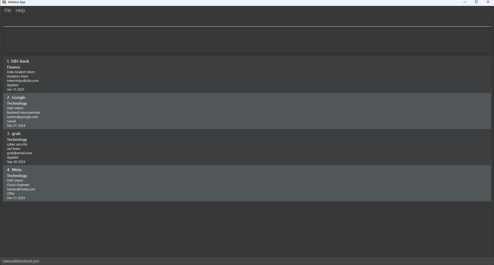
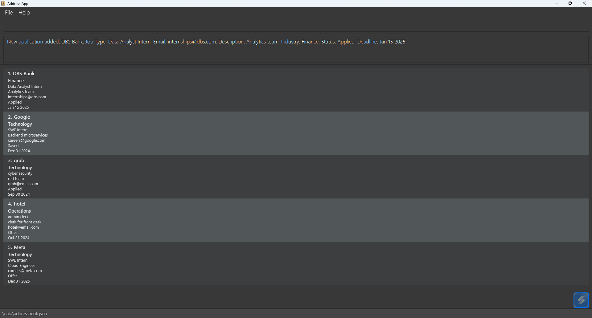
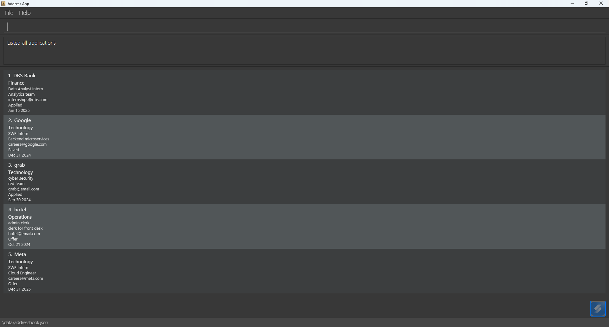
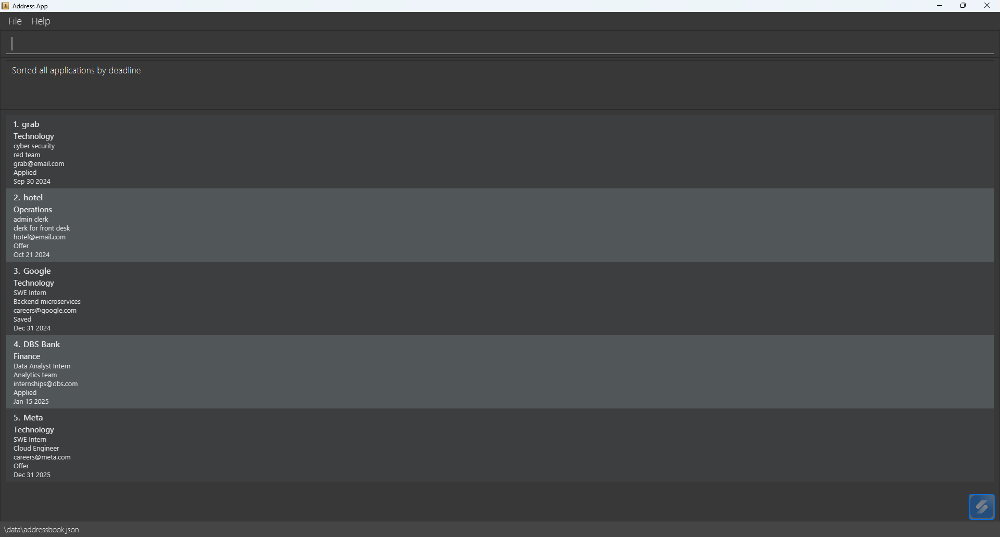
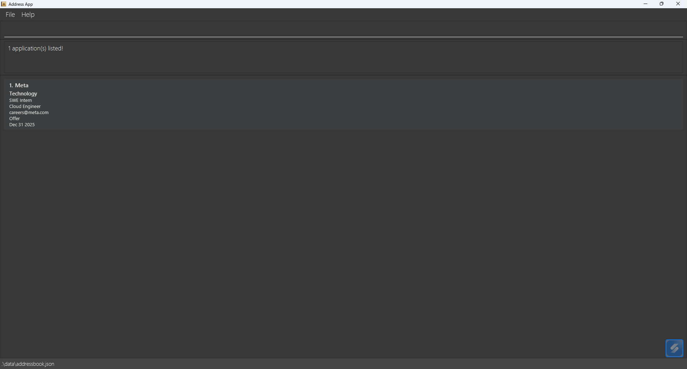
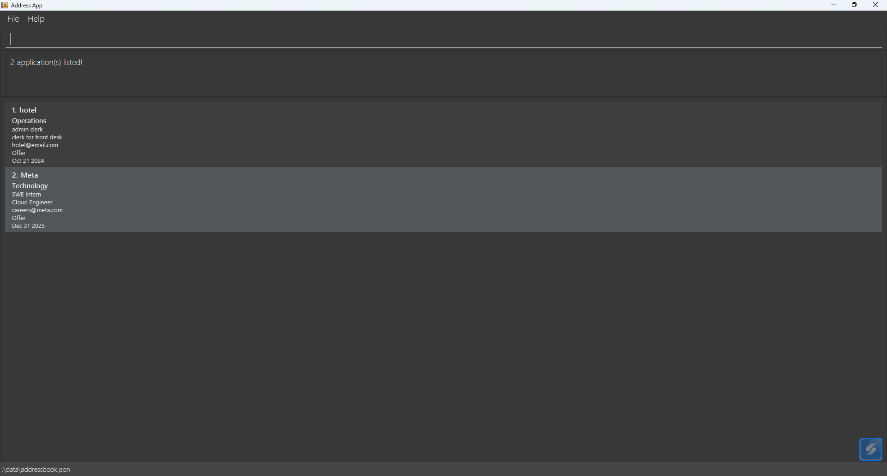
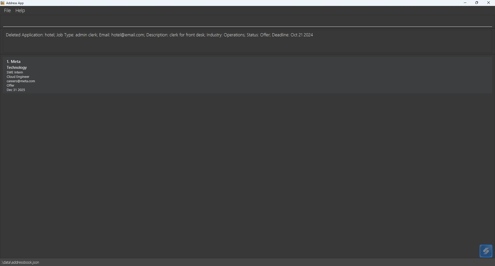

**Welcome to BizBook** – a tool designed to help students manage internship applications with speed and simplicity. BizBook streamlines your everyday tasks, such as tracking application statuses and managing deadlines, allowing you to organize important information in a fast, efficient way. By typing commands, you can quickly add, update, search, and handle your applications with minimal effort, making it a valuable companion for any busy student on an internship hunt.

### How BizBook addresses the problem:
* BizBook exposes succinct commands for adding, editing, finding, filtering and sorting applications, so users can complete common tasks with a few keystrokes.
* By keeping data local and serialised as JSON, users retain full control of their data and can transfer or back it up easily.
* The combination of a CLI and a simple GUI gives both productivity (keyboard-first workflows) and visual clarity (cards, status bar and help window).

### Background / comparison:
* Many users track applications with spreadsheets (Excel/Sheets) or general-purpose task managers (Trello, Notion). Those tools are flexible but often slower for repetitive text-entry tasks.
* Commercial applicant-tracking systems (e.g., Workable, Greenhouse) offer advanced features but are heavyweight and cloud-based. BizBook targets students and individuals who need a lightweight, local tool with fast keyboard-driven workflows.

* Table of Contents
{:toc}

--------------------------------------------------------------------------------------------------------------------

## Quick start

1. Ensure you have Java `17` or above installed in your Computer. 
   **Mac users:** Ensure you have the precise JDK version prescribed [here](https://se-education.org/guides/tutorials/javaInstallationMac.html).

1. Download the latest `.jar` file from [here](https://github.com/AY2526S1-CS2103T-T10-1/tp/).

1. Copy the file to the folder you want to use as the _home folder_ for your AddressBook.

1. Open a command terminal, `cd` into the folder you put the jar file in, and use the `java -jar BizBook.jar` command to run the application. 
   A GUI similar to the below should appear in a few seconds. Note how the app contains some sample data. 
   

1. Let's try typing these in order and see the result!

    **Step 1: Add your applications** -
    First, let's clear the sample data and add 3 new applications.
    * `clear`
    * `add n/Google i/Technology a/SWE Intern t/Backend microservices e/careers@google.com s/Saved d/2024-12-31`
    * `add n/DBS Bank i/Finance a/Data Analyst Intern t/Analytics team e/internships@dbs.com s/Saved d/2025-01-15`
    * `add n/ByteDance i/Technology a/PM Intern t/TikTok team e/hr@bytedance.com s/Saved d/2024-12-20`
    
    *Result:* Your list now shows 3 applications, in the order you added them.

    **Step 2: Prioritize and update** -
    You want to apply for the one with the *earliest* deadline first.
    * `sort deadline`
    
    *Result:* The list immediately re-orders. **ByteDance** is now at **Index 1**. Let's say you applied for it.
    * `edit 1 s/Applied`
    
    *Result:* The ByteDance card at Index 1 updates its status to `Applied`.

    **Step 3: Filter and delete** -
    Now you only want to see your "To-Do" list (status `Saved`).
    * `filter s/Saved`
    
    *Result:* The list is filtered, hiding "ByteDance". The status bar now says "2 applications listed".
    1.  **Google**
    2.  **DBS Bank**

    Looking at this filtered list, you decide you're not interested in DBS Bank (Index 2).
    * `delete 2`
    
    *Result:* The item at **Index 2** of the *current list* (DBS Bank) is permanently deleted.

    **Step 4: Reset and final check** -
    Finally, clear the filter to see *all* your remaining applications.
    * `list`
    
    *Result:* The filter is cleared. You now see your remaining applications: **ByteDance** (Status: `Applied`) and **Google** (Status: `Saved`). `DBS Bank` is gone.

    **Step 5: Exit** -
    Now that you have finished adding all your applications, you can now exit BizBook!
    * `exit`
    
1. Refer to the [Features](#features) below for details of each command.

--------------------------------------------------------------------------------------------------------------------

## Features

**:information_source: Notes about the command format:** 

* Words in `UPPER_CASE` are the parameters to be supplied by the user. 
  e.g. in `add n/COMPANY_NAME`, `COMPANY_NAME` is a parameter which can be used as `add n/Google`.

* Extraneous parameters for commands that do not take in parameters (such as `help`, `list`, `exit` and `clear`) will be ignored. 
  e.g. if the command specifies `help 123`, it will be interpreted as `help`.

* Items in square brackets are optional. 
  e.g `edit INDEX [n/COMPANY_NAME] [i/INDUSTRY] [a/JOB_ROLE] [e/EMAIL] [t/DESCRIPTION] [s/STATUS] [d/DEADLINE]` can be used with or without the description.

* If you are using a PDF version of this document, be careful when copying and pasting commands that span multiple lines as space characters surrounding line-breaks may be omitted when copied over to the application.

### Viewing help : `help`

Shows a message explaining how to access the help page.

Format: `help`

### Adding an application: `add`

Adds a new internship application to BizBook.

Format: `add n/COMPANY_NAME i/INDUSTRY a/JOB_ROLE t/DESCRIPTION e/EMAIL s/STATUS d/DEADLINE`

Notes:
- `COMPANY_NAME` can contain alphanumeric characters, spaces, and these special characters: `& . - ' ,` (e.g., AT&T, McDonald's, Apple Inc., Coca-Cola)
- `INDUSTRY` must be one of: Technology, Finance, Consulting, Healthcare, Marketing, Operations, Graphic Design
- `STATUS` must be one of: Saved, Applied, Interviewing, Offer, Rejected.
- `DEADLINE` must be in the format YYYY-MM-DD (e.g., 2024-12-31)
- You can add multiple applications to the same company as long as they are for different job roles (e.g., Google SWE Intern and Google PM Intern are both allowed)

Examples:
* `add n/Google i/Technology a/SWE Intern t/Backend microservices e/careers@google.com s/Saved d/2024-12-31`
* `add n/DBS Bank i/Finance a/Data Analyst Intern t/Analytics team e/internships@dbs.com s/Applied d/2025-01-15`
* `add n/AT&T i/Technology a/Network Intern t/5G deployment e/careers@att.com s/Saved d/2024-12-20` (company name with `&`)
* `add n/McDonald i/Operations a/Management Trainee t/Store operations e/hr@mcdonalds.com s/Applied d/2025-01-10` (company name with `'`)

sample output from running `add n/DBS Bank i/Finance a/Data Analyst Intern t/Analytics team e/internships@dbs.com s/Applied d/2025-01-15`

### Listing all applications : `list`

Shows a list of all internship applications in BizBook.

Format: `list`

sample output from running `list`

### Sorting applications : `sort`

> **Note:** After sorting, the list you see is the one affected by subsequent commands like `delete` or `edit`. For example, `delete 1` will delete the first application in the sorted list currently displayed.

Sorts all internship applications in the current list by the specified field.

Format: `sort FIELD`

Notes:
* `FIELD` must be one of: `name`, `status`, or `deadline`
* The field name is case-insensitive (e.g., `sort NAME` works the same as `sort name`)
* Sorting persists until you run another sort command with a different field
* Applications remain sorted even after adding, editing, or deleting entries

Examples:
* `sort name` - Sorts applications alphabetically by company name
* `sort status` - Sorts applications by status in logical workflow order (Saved → Applied → Interviewing → Offer → Rejected)
* `sort deadline` - Sorts applications chronologically by deadline (earliest first)

Typical usage:
* `list` followed by `sort deadline` shows all applications sorted by deadline to help you prioritize upcoming applications.
* `sort status` helps you see your application pipeline in logical progression order.

sample output from running `sort deadline`

### Editing an application : `edit`

Edits the details of an existing internship application.

Format: `edit INDEX [n/COMPANY_NAME] [i/INDUSTRY] [a/JOB_ROLE] [e/EMAIL] [t/DESCRIPTION] [s/STATUS] [d/DEADLINE]`

Notes:
* Edits the application at the specified `INDEX` (as shown in the current list). The index is **1-based**.
* At least one field to edit must be provided.
* Existing values will be overwritten by the new inputs.
* `COMPANY_NAME` can contain alphanumeric characters, spaces, and these special characters: `& . - ' ,`
* Input for `INDUSTRY` and `STATUS` is case-insensitive (e.g., `i/technology` and `s/applied` are accepted).
* `DEADLINE` must be in the format YYYY-MM-DD (e.g., 2024-12-31)

Examples:
* `edit 1 n/Google Singapore`
* `edit 2 s/Interviewing d/2025-02-28`
* `edit 3 a/Quant Intern t/Global Markets desk`

sample output from running `edit 1 s/applied`

### Finding applications by name : `find`

> **Note:** The results shown after a `find` command form a list that can be used with commands like `delete` or `edit`. For example, `delete 1` will delete the first application in the current search results.

Finds and lists all applications whose company names contain any of the specified keywords.

Format: `find KEYWORD [MORE_KEYWORDS]...`

Notes:
* The search is case-insensitive (e.g., `google` will match `Google`)
* **Partial matches are allowed** (e.g., `Tech` will match `TechCorp`, `FinTech`, and `Tech Solutions`)
* The order of keywords does not matter (e.g., `Bank DBS` will match `DBS Bank`)
* **Only the company name field is searched** - other fields like industry, job type, description, email, status, and deadline are not searched
* Applications matching at least one keyword will be returned (e.g., `Google Microsoft` will return applications for both Google and Microsoft)

Examples:
* `find Google` returns applications for `Google`, `Google Singapore`, and `GoogleTech`
* `find DBS OCBC` returns applications for `DBS Bank`, `OCBC`, and `DBS Group`
* `find Tech` returns `TechCorp`, `FinTech`, `Tech Solutions`, and any company with "Tech" in the name
* `find Meta` returns `Meta`, `Metaverse Inc`, and `MetaData Corp` (partial matches work)

sample output from running `find meta`

### Filtering applications by status and/or industry : `filter`

Filters and displays applications based on their status and/or industry. The filter does not modify the stored data, only affects what is displayed.

Format: `filter [s/STATUS] [i/INDUSTRY]`

Notes:
* **At least one filter criterion must be specified** - you can filter by status only, industry only, or both
* When both filters are specified, only applications matching **both criteria** will be shown (AND logic)
* The filter is case-insensitive (e.g., `s/applied` and `s/APPLIED` both work)
* `STATUS` must be one of: Saved, Applied, Interviewing, Offer, Rejected
* `INDUSTRY` must be one of: Technology, Finance, Consulting, Healthcare, Marketing, Operations, Graphic Design
* Use `list` to clear all filters and show all applications again

Examples:
* `filter s/Applied` - Shows only applications with "Applied" status
* `filter i/Technology` - Shows only applications in the Technology industry
* `filter s/Interviewing i/Finance` - Shows applications that are both "Interviewing" status AND in Finance industry
* `filter i/Healthcare s/Offer` - Same as above (order doesn't matter)

Typical usage:
* `filter s/Applied` followed by `sort deadline` to see all applied positions sorted by their deadlines
* `filter i/Technology s/Saved` to see all saved Technology positions you haven't applied to yet
* `list` to return to viewing all applications

sample output from running `filter s/offer`

### Deleting an application : `delete`

Deletes the specified internship application.

Format: `delete INDEX`

* Deletes the application at the specified `INDEX`.
* The index refers to the number shown in the current list being displayed. This includes lists shown after using commands such as `find`, `filter`, or `sort`. For example, after using `find Google`, `delete 1` deletes the first item in the search results you currently see, not the original unfiltered list.
* The index **must be a positive integer** 1, 2, 3, …​

Examples:
* `list` followed by `delete 2` deletes the 2nd application in the list.
* `find Google` followed by `delete 1` deletes the 1st application in the search results.

sample output from running `delete 1`

### Clearing all entries : `clear`

Clears all entries from BizBook.

Format: `clear`

### Exiting the program : `exit`

Exits the program.

Format: `exit`

### Saving the data

Data are saved to disk automatically after any command that changes data. There is no need to save manually.

### Editing the data file

Data are saved automatically as a JSON file `[JAR file location]/data/addressbook.json`. Advanced users may edit that file directly.

:exclamation: **Caution:**
If your changes to the data file makes its format invalid, the app will discard all data and start with an empty data file at the next run. Always back up the file before editing it. 
Furthermore, certain edits can cause the app to behave in unexpected ways (e.g., invalid values). Edit the data file only if you are confident you can update it correctly.

--------------------------------------------------------------------------------------------------------------------

## FAQ

**Q**: How do I transfer my data to another Computer? 
**A**: Install the app in the other computer and overwrite the empty data file it creates with the file that contains the data of your previous AddressBook home folder.

--------------------------------------------------------------------------------------------------------------------

## Known issues

1. **When using multiple screens**, if you move the application to a secondary screen, and later switch to using only the primary screen, the GUI will open off-screen. The remedy is to delete the `preferences.json` file created by the application before running the application again.
2. **If you minimize the Help Window** and then run the `help` command (or use the `Help` menu, or the keyboard shortcut `F1`) again, the original Help Window will remain minimized, and no new Help Window will appear. The remedy is to manually restore the minimized Help Window.

--------------------------------------------------------------------------------------------------------------------

## Command summary

Action | Format, Examples
--------|------------------
**Add** | `add n/COMPANY_NAME i/INDUSTRY a/JOB_ROLE t/DESCRIPTION e/EMAIL s/STATUS d/DEADLINE`   e.g., `add n/Google i/Technology a/SWE Intern t/Backend microservices e/careers@google.com s/Saved d/2024-12-31`
**Clear** | `clear`
**Delete** | `delete INDEX`  e.g., `delete 1`
**Edit** | `edit INDEX [n/COMPANY_NAME] [i/INDUSTRY] [a/JOB_ROLE] [e/EMAIL] [t/DESCRIPTION] [s/STATUS] [d/DEADLINE]`  e.g.,`edit 2 s/Interviewing d/2025-02-28`
**Exit** | `exit`
**Filter** | `filter [s/STATUS] [i/INDUSTRY]`   e.g., `filter s/Applied`, `filter i/Technology`, `filter s/Interviewing i/Finance`
**Find** | `find KEYWORD [MORE_KEYWORDS]...`  e.g., `find Google DBS`
**Help** | `help`
**List** | `list`
**Sort** | `sort FIELD`   e.g., `sort name`, `sort status`, `sort deadline`
